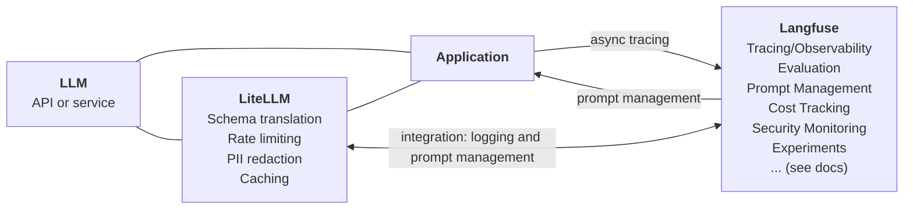

# The OSS LLMOps Stack

```mermaid
graph LR
  LLM["<strong>LLM</strong><br/>API or service"]
  App["<strong>Application</strong>"]
  Langfuse["<strong>Langfuse</strong><br/>Tracing/Observability<br/>Evaluation<br/>Prompt Management<br/>Cost Tracking<br/>Security Monitoring<br/>Experiments<br/>... (see docs)"]
  LiteLLM["<strong>LiteLLM</strong><br/>Schema translation<br/>Rate limiting<br/>PII redaction<br/>Caching"]

  App -->|async tracing|Langfuse
  Langfuse -->|prompt management| App
  LLM --- App
  LLM --- LiteLLM --- App
  LiteLLM <-->|"integration: logging and prompt management"| Langfuse
```
