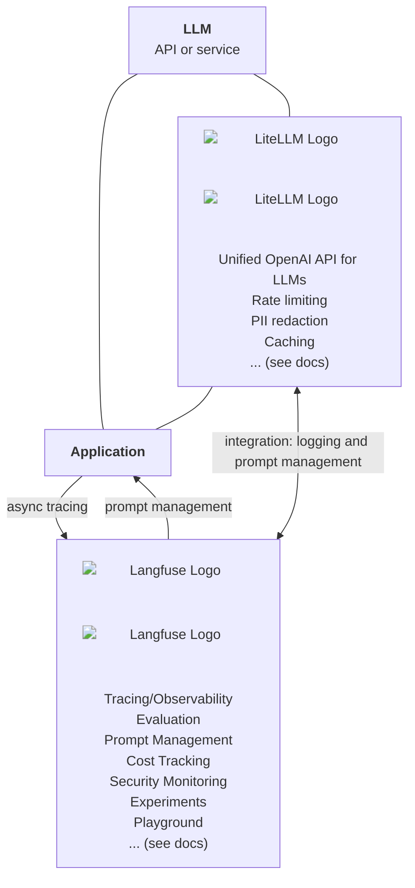
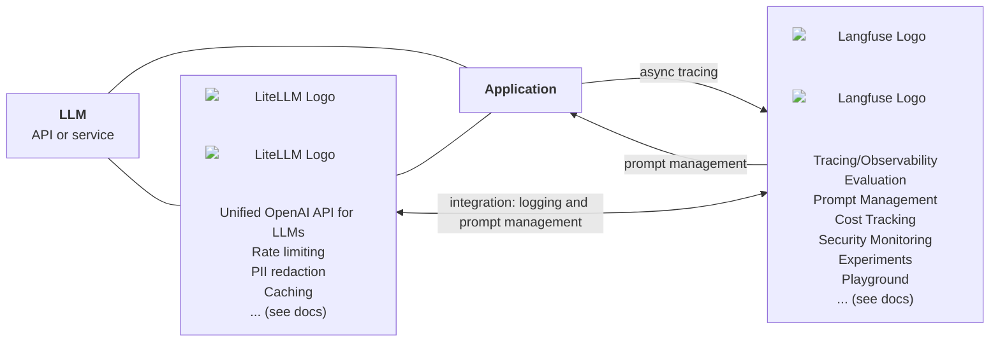
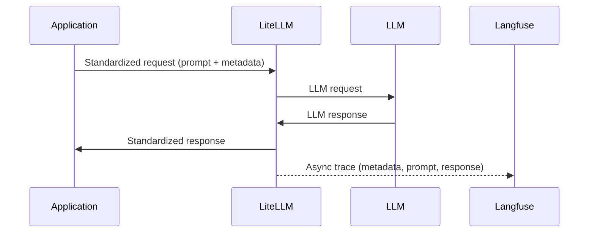

# Open Source LLMOps Stack

## Introduction

Choosing the right technology stack is one of the most critical decisions teams must make when building LLM-powered applications. The wrong choices can lead to vendor lock-in, limited flexibility, and high switching costs, all of which can stifle innovation and slow down iteration cycles.

Thus we introduce the "Open Source LLMOps Stack" as an open, well-integrated, scalable, and established setup backed by large OSS communities. It includes [LiteLLM](https://docs.litellm.ai/docs) ([GitHub](https://github.com/BerriAI/litellm)) as an LLM Proxy/Gateway and [Langfuse](https://langfuse.com/docs) ([GitHub](https://github.com/langfuse/langfuse)) for Observability, Evaluation and Prompt Management.

You can [deploy](/docs) this stack in a matter of minutes via the templates (HELM or docker compose) in your own environment. Read on to learn more.

## LiteLLM [#litellm]

> Model Routing, API Unification, Cost Management, Model Access Management

[**LiteLLM**](https://docs.litellm.ai/docs) is an open-source framework that simplifies LLM usage by providing a unified API for interacting with multiple LLM providers. It offers teams:

**Model Routing & API Unification**

- [**OpenAI-Compatible API**](https://docs.litellm.ai/docs/providers) – Access 100+ LLMs in the OpenAI format: Bedrock, VertexAI, Anthropic, Hugging Face, vLLM and more.
- [**Built-in failover mechanisms**](https://docs.litellm.ai/docs/proxy/reliability) – Automatically switch to alternative models if a provider is down.
- [**Load balancing**](https://docs.litellm.ai/docs/proxy/load_balancing) – Distribute traffic efficiently across multiple LLMs for scalability and reliability.

**Observability & Cost Management**

- [**Logging & request tracking**](https://docs.litellm.ai/docs/proxy/logging) – Capture logs of all requests and responses for debugging and analysis.
- [**Model Access Controls**](https://docs.litellm.ai/docs/proxy/virtual_keys) \- Control access to models by virtual keys, teams
- [**Budgets & Rate Limits**](https://docs.litellm.ai/docs/proxy/users) \- Track spend and set budget limits across models, keys, teams and custom tags
- [**Prompt versioning & A/B testing**](https://docs.litellm.ai/docs/proxy/prompt_management) – Manage different prompt iterations and compare effectiveness.

**Model Access Management**

- [**Virtual Keys**]((https://docs.litellm.ai/docs/proxy/virtual_keys) – Control access to models by virtual keys, teams and model access groups
- [**Self-serve Portal (SSO) \-**](https://docs.litellm.ai/docs/proxy/ui) Allow teams to login via SSO and manage their own keys in production with a self-serve key management portal

## Langfuse [#langfuse]

> Observability, Evaluation, and Prompt Management

<iframe
  width="100%"
  className="aspect-[16/9] rounded border w-full mt-10"
  src="https://www.youtube-nocookie.com/embed/2E8iTvGo9Hs?si=bT3wbaxdv2DIBCBo"
  title="YouTube video player"
  frameBorder="0"
  allow="accelerometer; autoplay; clipboard-write; encrypted-media; gyroscope; picture-in-picture; web-share"
  referrerPolicy="strict-origin-when-cross-origin"
  allowFullScreen
></iframe>

[**Langfuse**](https://langfuse.com/docs) complements LiteLLM by offering deep visibility and structured evaluations for LLM-powered applications. These are the core capabilities of Langfuse:

- [**LLM Application Observability/Tracing**](https://langfuse.com/docs/tracing): Instrument your app and start ingesting traces to Langfuse, thereby tracking LLM calls and other relevant logic in your app such as retrieval, embedding, or agent actions. Inspect and debug complex logs and user sessions. Try the interactive [demo](https://langfuse.com/docs/demo) to see this in action.
- [**Prompt Management**](https://langfuse.com/docs/prompts/get-started) helps you centrally manage, version control, and collaboratively iterate on your prompts. Thanks to strong caching on server and client side, you can iterate on prompts without adding latency to your application.
- [**Evaluations**](https://langfuse.com/docs/scores/overview) are key to the LLM application development workflow, and Langfuse adapts to your needs. It supports LLM-as-a-judge, user feedback collection, manual labeling, and custom evaluation pipelines via APIs/SDKs.
- [**Datasets**](https://langfuse.com/docs/datasets/overview) enable test sets and benchmarks for evaluating your LLM application. They support continuous improvement, pre-deployment testing, structured experiments, flexible evaluation, and seamless integration with frameworks like LangChain and LlamaIndex.
- [**LLM Playground**](https://langfuse.com/docs/playground) is a tool for testing and iterating on your prompts and model configurations, shortening the feedback loop and accelerating development. When you see a bad result in tracing, you can directly jump to the playground to iterate on it.
- [**Comprehensive API**](https://langfuse.com/docs/api): Langfuse is frequently used to power bespoke LLMOps workflows while using the building blocks provided by Langfuse via the API. OpenAPI spec, Postman collection, and typed SDKs for Python, JS/TS are available.

## Integration

LiteLLM and Langfuse integrate directly, thereby you can use LiteLLM as a central model gateway and Langfuse for observability, evals and prompt management. To learn more, see the [integration docs](https://docs.litellm.ai/docs/proxy/logging#langfuse).

<Callout type="info">
  Using Langfuse Prompts directly via LiteLLM is currently in beta
  ([docs](https://docs.litellm.ai/docs/proxy/prompt_management)). Thereby you
  can only pass the prompt variables to the LLM request and all prompt
  fetching/caching is done by LiteLLM. Alternatively, you can rely on the
  Langfuse SDKs to use prompts in your application code
  ([docs](https://langfuse.com/docs/prompts/get-started)).
</Callout>

## Why This Stack?

Choosing the right LLM Ops stack is critical for teams that require long-term flexibility, scalability, and control over their AI infrastructure. Many proprietary solutions impose vendor lock-in, limiting adaptability and making it difficult to iterate on workflows as technology evolves.

By adopting the **Open-Source LLM Ops Stack**, teams gain:

- **Self-Hosting & Open Source** – Both LiteLLM and Langfuse are open-source, allowing teams to deploy them in their own infrastructure while ensuring complete control over their LLM operations.
- **Technology Independence** – Avoid reliance on a single cloud provider or LLM vendor, ensuring the ability to switch models and providers with minimal friction.
- **Enterprise-Ready & Scalable** – These tools are built to handle large-scale deployments with robust performance, failover mechanisms, and high-availability setups.
- **Battle-Tested & Well-Documented** – Both projects (with a combined 25K Github Stars) are widely used in production environments and offer extensive documentation to support engineering teams.
- **Large Community & Active Development** – A vibrant open-source community actively contributes to both LiteLLM and Langfuse, ensuring continuous improvements, feature additions, and long-term viability.

## Getting Started with the Open Source LLMOps Stack

Deploying the stack is straightforward:

1. Deploy LiteLLM and Langfuse
2. Setup Integration by enabling callbacks from LiteLLM to Langfuse
3. Use LiteLLM gateway endpoints across your application
4. (optional) Setup evals and prompt management in Langfuse
5. Done

👉 [Follow the step-by-step tutorial](/docs)

## Questions/Feedback?

We are very much looking forward to your feedback!

- OSS LLMOps Stack: [Repo](https://github.com/langfuse/oss-llmops-stack)
- LiteLLM: [Issue tracker](https://github.com/BerriAI/litellm/issues), [Discord](https://discord.com/invite/wuPM9dRgDw)
- Langfuse: [Issue tracker](https://github.com/langfuse/langfuse/issues), [GitHub Discussions](https://github.com/langfuse/langfuse/discussions), [Discord](https://langfuse.com/discord), [Ask AI](https://langfuse.com/docs/ask-ai)
